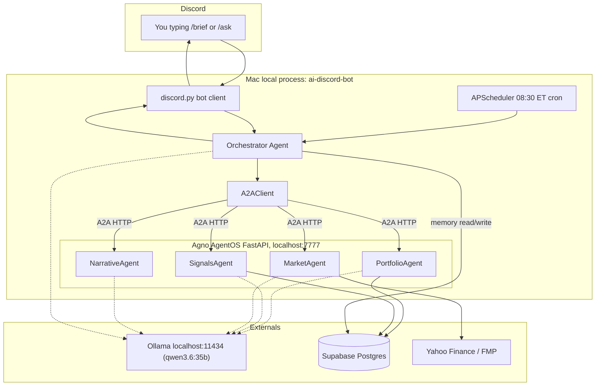

# ai-discord-bot

Local-only Python Discord bot that answers questions about your private
financial data and posts a scheduled morning brief. Runs entirely on your
Mac: Discord -> bot process -> Agno multi-agent orchestration ->
`qwen3.6:35b` via local Ollama -> Supabase.

- Code: [ai-discord-bot/](../../ai-discord-bot/)
- Workspace README (setup + quick start): [ai-discord-bot/README.md](../../ai-discord-bot/README.md)
- Plan origin: `Local Agno Discord Bot` plan

## Goals

- **Private**: your trade data, positions, and P&L never leave the Mac. All
  LLM inference happens in local Ollama.
- **Conversational**: beyond a daily digest, you can follow up with
  free-form questions and the bot has persistent channel memory.
- **Multi-agent**: a single orchestrator delegates to specialized agents
  via the A2A protocol, so each agent stays focused on one concern.

## Architecture



### Why this shape

- **Single Ollama model** across all agents (`qwen3.6:35b`). Agno `Agent` is
  system-prompt + tools + loop around a model; it does not load separate
  weights per agent. On a 36 GB Mac this keeps the model resident and
  avoids any swap thrashing.
- **A2A over localhost HTTP** is slight overhead for same-process agents
  but gives a clean upgrade path if a specialist later moves to another
  machine. The call is 1-2 ms on loopback.
- **One process** hosts both the FastAPI AgentOS and the Discord client,
  sharing one asyncio loop. Start one thing, stop one thing.

## Agents and tools

### Orchestrator

Decides which specialists to call and in what order, based on the user's
question (or a scheduled brief trigger). Synthesizes specialist outputs
via NarrativeAgent. Reads/writes conversation memory.

System prompt: [`ORCHESTRATOR_PROMPT`](../../ai-discord-bot/src/ai_discord_bot/agents/system_prompts.py).

Tools exposed to the orchestrator are A2A call wrappers:
`consult_portfolio_agent`, `consult_signals_agent`, `consult_market_agent`,
`compose_final_message`.

### PortfolioAgent

Read-only access to `user_positions`, `user_spreads`, and
`cds_signal_outcomes`.

- `get_portfolio_snapshot()` - open positions + spreads.
- `get_open_spreads(ticker?)` - filtered spreads.
- `get_pnl_history(days=30)` - realized P&L window.
- `calculate_spread(...)` - shared deterministic math.

### SignalsAgent

Read-only access to the unified `signals` table, `unusual_options_signals`,
and historical CDS outcomes.

- `get_recent_signals(strategy="all", days=3, min_grade="B")`.
- `get_unusual_options_activity(ticker?, limit=20)`.
- `search_cds_outcomes(ticker?, outcome?)` - decision-journal-adjacent.

### MarketAgent

Live data via Yahoo Finance + optional FMP fallback.

- `get_ticker_data(ticker)` - live quote.
- `get_trading_regime()` - coarse GO / CAUTION / NO_TRADE label based on
  SPY day change and VIX.
- `calculate_spread(...)` - shared deterministic math.

### NarrativeAgent

No tools. Receives structured outputs from other specialists and composes
one Discord message under 1800 characters.

## Strict tool-use rule

Every specialist's system prompt embeds `STRICT_TOOL_USE` from
[`system_prompts.py`](../../ai-discord-bot/src/ai_discord_bot/agents/system_prompts.py):

> You MAY NOT answer any question about a specific ticker, position, or
> portfolio state without first calling the appropriate tools.
> Any answer given WITHOUT tool calls is automatically WRONG.

This is the exact discipline we proved in
[docs/local-ai-eval/README.md](../local-ai-eval/README.md) moves Qwen3.6
from 0/2 PASS to 3/3 PASS on agent tasks. It is non-optional.

## Memory

New table `agent_conversations` (migration at
[ai-discord-bot/migrations/001_agent_conversations.sql](../../ai-discord-bot/migrations/001_agent_conversations.sql)).
Every turn (user, assistant, tool) is written as a row; the orchestrator
loads the most recent 20 turns per channel as prior context. No
summarization in V1.

## Scheduling

`APScheduler` in-process cron fires the morning brief on weekdays at
`BRIEF_CRON_HOUR:BRIEF_CRON_MINUTE` in `BRIEF_CRON_TZ` (defaults 08:30
America/New_York). The result is posted to `DISCORD_BOT_CHANNEL_ID`.

If your Mac is asleep at fire time, the brief is skipped for that day
(catchup is V2 work).

## Setup

See the workspace README: [ai-discord-bot/README.md](../../ai-discord-bot/README.md).

Short version:

1. `bun run py:bot:install`.
2. Create a Discord bot in the [Developer Portal](https://discord.com/developers/applications); invite to your server.
3. Set `DISCORD_BOT_TOKEN`, `DISCORD_BOT_GUILD_ID`, `DISCORD_BOT_CHANNEL_ID` in repo-root `.env.local`.
4. Apply the migration: `psql "$NEXT_PUBLIC_SUPABASE_URL" -f ai-discord-bot/migrations/001_agent_conversations.sql`.
5. Ensure Ollama has `qwen3.6:35b` pulled: `ollama list | grep qwen3.6`.
6. `bun run py:bot`.

## Known limits (V1)

- Bot is online only while the process is running and your Mac is awake.
- Scheduled brief is skipped if the Mac is asleep at 08:30 ET.
- No fine-grained market-data rate limiting yet; if you spam `/ask NVDA`-style
  questions, Yahoo may 429 the MarketAgent. V2: add per-ticker TTL cache.
- No decision-journal-style retrieval beyond `search_cds_outcomes`. V2:
  embedding-based retrieval over `agent_conversations`.
- No shared TS/Python config. Python reads its own env; the TS
  `@portfolio/ai-config` resolver is not consulted. V2 could unify via a
  YAML file both stacks read.

## Files

```
ai-discord-bot/
  pyproject.toml
  README.md
  .env.example
  migrations/
    001_agent_conversations.sql
  src/ai_discord_bot/
    __init__.py
    config.py
    main.py
    bot/
      client.py       # discord.py slash commands
      formatter.py    # chunk_for_discord
    agents/
      orchestrator.py
      portfolio_agent.py
      signals_agent.py
      market_agent.py
      narrative_agent.py
      system_prompts.py
    tools/
      db.py
      portfolio_tools.py
      signals_tools.py
      market_tools.py
      calc_tools.py
    scheduling/
      brief_scheduler.py
    memory/
      supabase_memory.py
```

## Related docs

- [docs/local-ai-eval/README.md](../local-ai-eval/README.md) - eval findings
  that drove the model choice and strict-prompt rule.
- [docs/monorepo/README.md#local-ai](../monorepo/README.md#local-ai) -
  where this bot fits in the Local AI story and how it differs from the
  TS resolver used by the rest of the repo.
