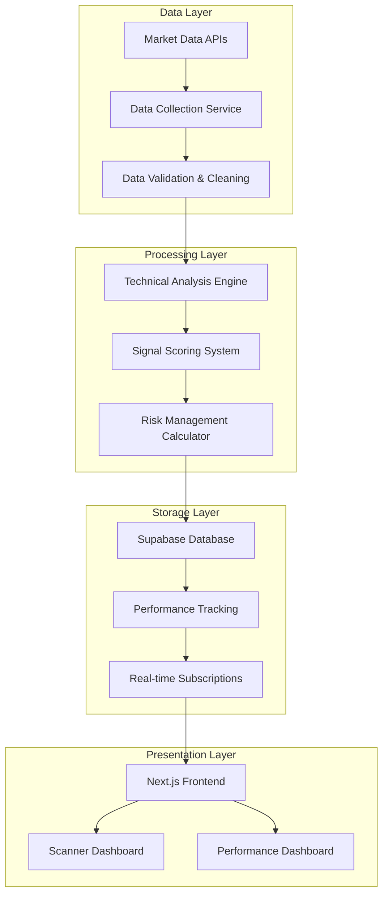

# Technical Implementation Guide

## Architecture Overview

The Volatility Squeeze Scanner is built with a modern, scalable architecture that separates concerns between data processing, analysis, storage, and presentation.



## Backend Services

### 1. Data Collection Service (`enhanced_data_service.py`)

Responsible for fetching and processing market data from multiple sources.

```python
class EnhancedDataService:
    def __init__(self):
        self.providers = [YahooFinanceProvider(), AlphaVantageProvider()]
        self.cache = RedisCache()
        
    async def fetch_ohlcv_data(self, symbol: str, period: int = 127) -> OHLCVData:
        """Fetch OHLCV data with fallback providers and caching."""
        cache_key = f"ohlcv:{symbol}:{period}"
        
        if cached_data := self.cache.get(cache_key):
            return cached_data
            
        for provider in self.providers:
            try:
                data = await provider.fetch_data(symbol, period)
                if self._validate_data(data):
                    self.cache.set(cache_key, data, ttl=300)  # 5 min cache
                    return data
            except Exception as e:
                logger.warning(f"Provider {provider} failed: {e}")
                
        raise DataUnavailableError(f"No data available for {symbol}")
```

### 2. Technical Analysis Engine (`analysis_service.py`)

Core engine that calculates technical indicators and generates signals.

```python
class AnalysisService:
    def analyze_symbol(self, symbol: str) -> AnalysisResult:
        """Complete technical analysis for a single symbol."""
        
        # 1. Fetch market data
        ohlcv_data = self.data_service.fetch_ohlcv_data(symbol)
        
        # 2. Calculate technical indicators
        indicators = self.calculate_all_indicators(ohlcv_data)
        
        # 3. Detect squeeze conditions
        squeeze_signal = self.detect_squeeze(indicators)
        
        # 4. Calculate signal strength
        signal_strength = self._calculate_signal_strength(squeeze_signal, indicators)
        
        # 5. Generate recommendation
        recommendation = self._generate_recommendation(signal_strength, squeeze_signal)
        
        # 6. Calculate risk management parameters
        stop_loss = self._calculate_stop_loss(squeeze_signal, indicators)
        position_size = self._calculate_position_size(signal_strength)
        
        return AnalysisResult(
            symbol=symbol,
            squeeze_signal=squeeze_signal,
            signal_strength=signal_strength,
            recommendation=recommendation,
            stop_loss_level=stop_loss,
            position_size_pct=position_size
        )
```

### 3. Signal Scoring Algorithm

The core algorithm that determines signal quality:

```python
def _calculate_signal_strength(self, squeeze_signal: SqueezeSignal, indicators) -> float:
    """Calculate comprehensive signal strength (0.0 to 1.0)."""
    
    # Base squeeze intensity (40% weight)
    squeeze_score = self._calculate_squeeze_intensity(
        squeeze_signal.bb_width_percentile,
        squeeze_signal.is_squeeze
    )
    
    # Volume confirmation (30% weight)  
    volume_score = self._calculate_volume_score(
        squeeze_signal.volume_ratio,
        indicators.volume_sma_20
    )
    
    # Trend alignment (20% weight)
    trend_score = self._calculate_trend_score(
        squeeze_signal.trend_direction,
        indicators.ema_20,
        indicators.ema_50
    )
    
    # Technical momentum (10% weight)
    momentum_score = self._calculate_momentum_score(
        indicators.rsi_14,
        indicators.macd_histogram
    )
    
    # Weighted combination
    total_score = (
        squeeze_score * 0.4 +
        volume_score * 0.3 +
        trend_score * 0.2 +
        momentum_score * 0.1
    )
    
    return min(max(total_score, 0.0), 1.0)

def _calculate_squeeze_intensity(self, bb_width_percentile: float, is_squeeze: bool) -> float:
    """Calculate squeeze intensity based on Bollinger Band width percentile."""
    if not is_squeeze:
        return 0.0
        
    # Extremely tight squeezes get highest scores
    if bb_width_percentile <= 5:
        return 1.0
    elif bb_width_percentile <= 10:
        return 0.9
    elif bb_width_percentile <= 20:
        return 0.7
    elif bb_width_percentile <= 30:
        return 0.5
    else:
        return 0.2
```

### 4. Risk Management System

Automated calculation of stop losses and position sizing:

```python
def _calculate_stop_loss(self, squeeze_signal: SqueezeSignal, indicators) -> float:
    """Calculate adaptive stop loss based on volatility and signal strength."""
    
    atr = indicators.atr_20 or 0.0
    if atr <= 0:
        return None
    
    # Base ATR multiplier
    base_multiplier = 1.5
    
    # Adjust for signal quality (higher quality = tighter stops)
    if squeeze_signal.signal_strength > 0.8:
        base_multiplier = 1.2
    elif squeeze_signal.signal_strength < 0.4:
        base_multiplier = 2.0
    
    # Adjust for volatility environment
    if squeeze_signal.bb_width_percentile <= 5:
        base_multiplier *= 0.8  # Tighter in extremely low vol
    elif squeeze_signal.bb_width_percentile >= 50:
        base_multiplier *= 1.2  # Wider in higher vol
    
    # Volume confirmation adjustment
    if squeeze_signal.volume_ratio > 2.0:
        base_multiplier *= 0.9  # Tighter with volume confirmation
    
    stop_distance = atr * base_multiplier
    
    # Calculate stop level based on trend direction
    if squeeze_signal.trend_direction == TrendDirection.BULLISH:
        return squeeze_signal.close_price - stop_distance
    else:
        return squeeze_signal.close_price + stop_distance

def _calculate_position_size(self, signal_strength: float) -> float:
    """Calculate position size as percentage of portfolio."""
    
    # Base position size: 1-5% based on signal strength
    base_size = 0.01  # 1%
    max_size = 0.05   # 5%
    
    # Scale with signal strength
    position_size = base_size + (signal_strength * (max_size - base_size))
    
    return round(position_size, 4)
```

## Database Design

### Core Tables

```sql
-- Main signals table with comprehensive technical data
CREATE TABLE volatility_squeeze_signals (
    id UUID PRIMARY KEY DEFAULT gen_random_uuid(),
    symbol VARCHAR(10) NOT NULL,
    scan_date DATE NOT NULL,
    
    -- Price data
    close_price DECIMAL(12,4) NOT NULL,
    high_price DECIMAL(12,4),
    low_price DECIMAL(12,4),
    volume BIGINT,
    
    -- Signal metrics
    overall_score DECIMAL(5,4) NOT NULL,
    signal_strength DECIMAL(5,4),
    technical_score DECIMAL(5,4),
    
    -- Squeeze analysis
    is_squeeze BOOLEAN NOT NULL,
    is_expansion BOOLEAN,
    bb_width_percentile DECIMAL(5,2),
    squeeze_category VARCHAR(20),
    
    -- Technical indicators
    bb_upper DECIMAL(12,4),
    bb_middle DECIMAL(12,4),
    bb_lower DECIMAL(12,4),
    kc_upper DECIMAL(12,4),
    kc_middle DECIMAL(12,4),
    kc_lower DECIMAL(12,4),
    atr_20 DECIMAL(8,4),
    
    -- Trading signals
    recommendation VARCHAR(20),
    is_actionable BOOLEAN DEFAULT false,
    opportunity_rank CHAR(1),
    signal_quality VARCHAR(20),
    
    -- Risk management
    stop_loss_price DECIMAL(12,4),
    stop_loss_distance_pct DECIMAL(5,2),
    position_size_pct DECIMAL(5,4),
    
    -- Trend and volume
    trend_direction VARCHAR(10),
    volume_ratio DECIMAL(8,4),
    
    -- Performance tracking
    signal_status VARCHAR(10) DEFAULT 'ACTIVE',
    days_since_scan INTEGER DEFAULT 0,
    
    -- Metadata
    market_regime VARCHAR(20),
    updated_at TIMESTAMP DEFAULT NOW(),
    
    -- Indexes
    UNIQUE(symbol, scan_date)
);

-- Performance tracking table
CREATE TABLE signal_performance (
    id UUID PRIMARY KEY DEFAULT gen_random_uuid(),
    signal_id UUID NOT NULL REFERENCES volatility_squeeze_signals(id),
    symbol VARCHAR(10) NOT NULL,
    
    -- Entry details
    entry_date DATE NOT NULL,
    entry_price DECIMAL(12,4) NOT NULL,
    entry_score DECIMAL(5,4),
    entry_recommendation VARCHAR(20),
    
    -- Exit details
    exit_date DATE,
    exit_price DECIMAL(12,4),
    exit_reason VARCHAR(20),
    
    -- Performance metrics
    return_pct DECIMAL(8,4),
    return_absolute DECIMAL(12,4),
    days_held INTEGER,
    is_winner BOOLEAN,
    
    -- Risk metrics
    max_adverse_excursion_pct DECIMAL(8,4),
    max_favorable_excursion_pct DECIMAL(8,4),
    stop_loss_price DECIMAL(12,4),
    
    -- Signal characteristics
    bb_width_percentile DECIMAL(5,2),
    squeeze_category VARCHAR(20),
    trend_direction VARCHAR(10),
    market_regime VARCHAR(20),
    initial_risk_pct DECIMAL(5,2),
    
    -- Status
    status VARCHAR(10) DEFAULT 'ACTIVE',
    created_at TIMESTAMP DEFAULT NOW(),
    updated_at TIMESTAMP DEFAULT NOW()
);
```

### Live Performance Tracking Service

The `PerformanceTrackingService` provides comprehensive real-time monitoring of signal performance:

```python
class PerformanceTrackingService:
    """Service for tracking real-world performance of volatility squeeze signals."""
    
    async def track_new_signals(self, signals: List[AnalysisResult], scan_date: date) -> int:
        """Track new signals in the performance tracking system."""
        # Only track actionable signals with valid recommendations
        # Create performance tracking records with entry data
        
    async def close_ended_signals(self, ended_symbols: List[str], scan_date: date) -> int:
        """Close performance tracking for signals that have ended."""
        # Calculate returns, days held, win/loss status
        # Update performance records with exit data
```

### Automated Performance Tracking

```sql
-- Trigger to automatically track new actionable signals
CREATE OR REPLACE FUNCTION track_new_signal()
RETURNS TRIGGER AS $$
BEGIN
    IF NEW.is_actionable = true AND NEW.recommendation IN ('STRONG_BUY', 'BUY', 'WATCH') THEN
        INSERT INTO signal_performance (
            signal_id, symbol, entry_date, entry_price, entry_score,
            entry_recommendation, stop_loss_price, bb_width_percentile,
            squeeze_category, trend_direction, market_regime, status
        ) VALUES (
            NEW.id, NEW.symbol, NEW.scan_date, NEW.close_price, NEW.overall_score,
            NEW.recommendation, NEW.stop_loss_price, NEW.bb_width_percentile,
            CASE 
                WHEN NEW.bb_width_percentile <= 5 THEN 'Extremely Tight'
                WHEN NEW.bb_width_percentile <= 15 THEN 'Very Tight'
                WHEN NEW.bb_width_percentile <= 30 THEN 'Tight'
                ELSE 'Normal'
            END,
            NEW.trend_direction, NEW.market_regime, 'ACTIVE'
        );
    END IF;
    RETURN NEW;
END;
$$ LANGUAGE plpgsql;

CREATE TRIGGER track_new_signal_trigger
    AFTER INSERT ON volatility_squeeze_signals
    FOR EACH ROW
    EXECUTE FUNCTION track_new_signal();
```

## Frontend Implementation

### Real-time Data Flow

```typescript
// Main scanner component with real-time updates
export default function VolatilitySqueezeScanner() {
  const [signals, setSignals] = useState<VolatilitySqueezeSignal[]>([]);
  const [performance, setPerformance] = useState<PerformanceDashboard | null>(null);
  
  // Load data with parallel fetching
  const loadData = useCallback(async () => {
    const [signalsResponse, statsData, performanceData] = await Promise.all([
      fetchVolatilitySignals({ limit: 100, sortBy: 'overall_score', sortOrder: 'desc' }),
      fetchSignalStats(),
      fetchPerformanceDashboard()
    ]);
    
    setSignals(signalsResponse.data);
    setPerformance(performanceData);
  }, []);
  
  // Real-time subscriptions
  useEffect(() => {
    const unsubscribe = subscribeToSignalUpdates((payload) => {
      // Handle real-time signal updates
      loadData();
    });
    
    return unsubscribe;
  }, [loadData]);
}
```

### Performance Dashboard Integration

```typescript
// Live performance metrics display
{performance && (
  <div className="grid grid-cols-1 md:grid-cols-3 gap-4">
    <Link href="/volatility-squeeze-scanner/performance" 
          className="block p-4 rounded-lg border hover:bg-card transition-all">
      <div className="space-y-1">
        <p className="text-sm text-muted-foreground">Win Rate</p>
        <p className="text-xl font-light">
          {performance.win_rate_all ? `${performance.win_rate_all}%` : '—'}
        </p>
      </div>
    </Link>
    {/* Additional performance cards... */}
  </div>
)}
```

## Deployment & Scaling

### Production Architecture

```yaml
# Docker Compose for production deployment
version: '3.8'
services:
  scanner-api:
    image: volatility-scanner:latest
    environment:
      - DATABASE_URL=${SUPABASE_URL}
      - API_KEYS=${DATA_PROVIDER_KEYS}
    deploy:
      replicas: 3
      resources:
        limits:
          memory: 1G
          cpus: '0.5'
  
  redis-cache:
    image: redis:alpine
    deploy:
      resources:
        limits:
          memory: 256M
  
  frontend:
    image: scanner-frontend:latest
    environment:
      - NEXT_PUBLIC_SUPABASE_URL=${SUPABASE_URL}
      - NEXT_PUBLIC_SUPABASE_ANON_KEY=${SUPABASE_ANON_KEY}
    deploy:
      replicas: 2
```

### Performance Optimization

1. **Database Indexing**:
   ```sql
   CREATE INDEX idx_signals_score_date ON volatility_squeeze_signals(overall_score DESC, scan_date DESC);
   CREATE INDEX idx_signals_actionable ON volatility_squeeze_signals(is_actionable, scan_date DESC);
   CREATE INDEX idx_performance_symbol_date ON signal_performance(symbol, entry_date);
   ```

2. **Caching Strategy**:
   - Redis for API responses (5-minute TTL)
   - Browser caching for static assets
   - CDN for global distribution

3. **Database Optimization**:
   - Connection pooling
   - Read replicas for analytics
   - Automated cleanup of old data

## Monitoring & Alerting

### System Health Monitoring

```python
# Health check endpoints
@app.get("/health")
async def health_check():
    checks = {
        "database": await check_database_connection(),
        "data_providers": await check_data_providers(),
        "cache": await check_redis_connection(),
        "signal_generation": await check_recent_signals()
    }
    
    status = "healthy" if all(checks.values()) else "unhealthy"
    return {"status": status, "checks": checks}

# Performance monitoring
@app.middleware("http")
async def monitor_performance(request: Request, call_next):
    start_time = time.time()
    response = await call_next(request)
    process_time = time.time() - start_time
    
    # Log slow requests
    if process_time > 1.0:
        logger.warning(f"Slow request: {request.url} took {process_time:.2f}s")
    
    return response
```

### Alerting Rules

1. **Data Quality Alerts**:
   - No signals generated in 2+ hours
   - Data provider failures
   - Unusual signal patterns

2. **Performance Alerts**:
   - API response time > 2 seconds
   - Database connection failures
   - High error rates

3. **Trading Alerts**:
   - Large drawdowns in strategy performance
   - Significant changes in win rate
   - System-wide stop loss triggers

## Recent Fixes and Improvements

- **Fixed ATR Attribute Error (October 2025)**: Added `atr_20` field to `TechnicalIndicators` model in `src/volatility_scanner/models/market_data.py` to resolve `'TechnicalIndicators' object has no attribute 'atr_20'` errors during analysis. This defaults to the existing `atr` value (20-period calculation) and prevents scan failures across symbols. Ensures consistent signal generation without altering core strategy logic.

This technical implementation provides a robust, scalable foundation for the volatility squeeze scanner with comprehensive monitoring, performance tracking, and real-time capabilities.
