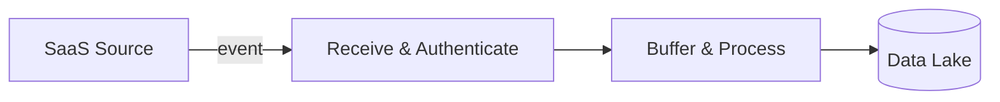
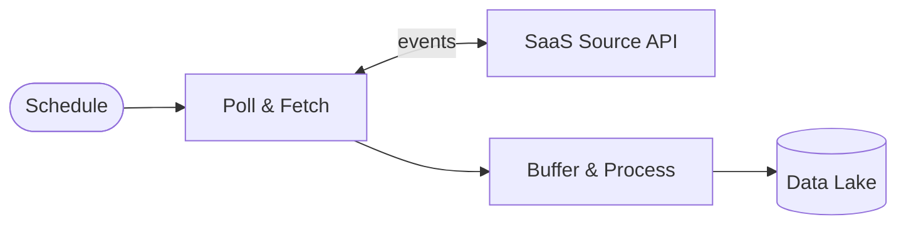
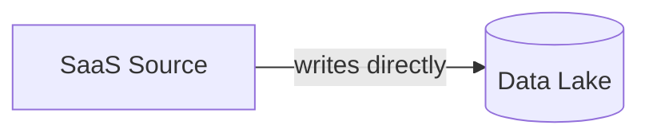

## Introduction

We were missing a critical layer in our security stack: our data layer.
Instead of buying a commercial security data pipeline for five figures a year,
I built it in-house for less than four figures, and that's what unlocked operationalizing
our Security Analytics Mesh (SAM) and gave us real visibility across the multitude of SaaS tools we depend on.

When I started looking at what we'd need to operationalize our SAM tool, two things were obvious:

- **Faster to build our own integrations than wait on the vendor's roadmap.**
  Our architecture let me ship a new source in an afternoon. Waiting on a third party meant weeks-to-quarters, per source.
- **Our data needed to live in our environment.**
  Security logs are some of the most sensitive data we have, and routing them through their servers where _they_ control
  retention, access, and storage wasn't a long-term governance posture I was willing to accept.
  Keeping the data in our own AWS account meant we owned it end-to-end.

What follows is how I architected and built our **Log Ingestion Pipeline (LIP)** — how it works, what broke, and what I'd do differently next time.

## The Problem

The core challenge wasn't just "collect some logs", every vendor exposes their data differently.
Some push events via webhooks, stream directly to cloud storage, or a REST API you have to poll.
Not only that, but each one has its own authentication scheme, pagination model, rate limits, and payload format.

I needed an architecture flexible enough to handle all three patterns while keeping the operational complexity manageable.
Just as important, I was designing for the team I didn't have yet; whatever I built had to be easy for someone else to learn,
maintain, and extend. Not just by me, by anyone who picks it up next month, next quarter, or after I'm gone.
This bore clear abstractions, conventional patterns, and ruthless consistency across every source.

I laid out clear requirements when working on the pipeline:

1. **Collect logs** from every security-relevant SaaS platform we use
2. **Normalize and deliver** them into S3
3. **Ensure reliability** — no events lost, even during outages or API failures
4. **Integrate with the SAM** so it discovers and indexes new data automatically
5. **Keep it simple enough** that I could add a new source in an afternoon

The rule I held myself to: if this pipeline went down at 6PM, I needed to be able to tell what
broke and why without re-reading code I wrote three months ago. Boring beat clever, every time.

## The Architecture

I landed on a fully serverless AWS architecture for three reasons.
**Cost:** pay-per-use meant I could start small and scale.
**Operational simplicity:** no servers to patch or capacity to plan.
Most importantly, the whole system stays inside our existing AWS bill.
No new vendor relationship, no procurement cycle, no additional security review of a third-party tool
that would itself be handling our security logs. That last point alone made it an easy sell internally.

### Three Ingestion Patterns

**Webhook (Push)**: for sources that deliver events in real-time:



The source pushes events to an API Gateway endpoint. A Lambda validates authentication, deduplicates
events using DynamoDB conditional writes, and batches them into SQS. A second Lambda pulls from SQS,
flattens the events into NDJSON, and writes to Kinesis Firehose for buffered delivery to S3.
This covers our **identity provider** and **endpoint management** sources, where real-time visibility matters most.

**Polling (Pull)**: for sources that only expose a REST API:



An EventBridge schedule triggers a poller Lambda every few minutes.
The poller authenticates, fetches new events using a cursor stored in DynamoDB, and pushes them
into the same SQS → Processor → Firehose → S3 pipeline. This handles our **collaboration platform audit logs**,
**password manager events**, **email and productivity suite logs**, and **cloud workspace activity**.

**S3 Streaming (Native)**: for sources that can write directly to cloud storage:



The simplest path. No Lambda, no SQS, no Firehose. Just IAM credentials and a bucket policy.
This covers our **development platform audit logs** and **network security logs**.

### The Common Destination

Regardless of how logs get there, every event ends up in the same place: a dedicated, KMS-encrypted S3 bucket with a consistent path structure:

```text
source=<name>/year=YYYY/month=MM/day=DD/hour=HH/<timestamp>_<uuid>.ndjson.gz
```

The SAM connects to these buckets and queries them directly.
S3 event notifications tell the SAM when new files land so it can update its indexes automatically.
This decoupled design means I can add new sources without touching the analytics layer at all.

## The Challenges That Humbled Me

### Building the Poller Framework

The polling pattern was the most complex to get right, and it's where I spent the most engineering time.
I needed to poll four different APIs, each with different authentication schemes, pagination models, and rate limits.

My first instinct was to write a standalone Lambda for each source.
I got one working, started on the second, and immediately realized I was duplicating 80% of the code: secrets caching,
cursor management, SQS batching, error handling. I remember thinking: _"If I keep going like this,
I'll have four Lambda functions that are 80% identical and 100% unmaintainable."_

So I stopped and built an abstract base class that handles all the shared infrastructure:

```python
class BasePoller(ABC):
    Abstract base class for polling-based log sources.

    @abstractmethod
    def get_auth_token(self) -> str:
        Retrieve authentication token from secrets.

    @abstractmethod
    def call_api(self, auth_token, endpoint, cursor=None, start_time=None) -> PollResult:
        Make API request and return parsed results.

    @abstractmethod
    def get_cursor_key(self, endpoint) -> dict[str, str]:
        Get the DynamoDB key for cursor state.
```

Each source adapter only needs to implement three methods: how to authenticate,
how to call the API, and where to store the cursor.
The base class handles everything else.
The abstraction slowed me down by maybe a day. It paid that day back within the week.

The most interesting design decision was **time-based dynamic paging**.
Instead of fetching a fixed number of pages per invocation, the poller checks how much Lambda
execution time remains and keeps fetching until a safety buffer is reached:

```python
while has_more and _has_time():
    result = self.call_api(auth_token, endpoint, cursor=cursor)
    cursor = result.cursor
    has_more = result.has_more

    if result.events:
        sent = self.send_events_to_sqs(result.events, endpoint)
        total_events += sent
```

Throughput scales automatically with the Lambda timeout configuration.
A 60-second timeout yields ~20 pages. A 300-second timeout yields ~120 pages.
Bumping a single Terraform variable from 60 to 300 was enough to 5x throughput
on a backfill, no code changes anywhere!!

### The Backpressure Problem

One of the failure modes I worried about early on was the poller outpacing the processor.
If the source API returns thousands of events per page and the processor can't keep up,
the SQS queue grows unbounded, costs spike, and latency degrades.

I built a backpressure mechanism into the base poller.
Before each poll cycle, it checks the SQS queue depth:

```python
def check_backpressure(self) -> tuple[bool, float]:
    depth = self.get_queue_depth()

    if depth >= BACKPRESSURE_SKIP_THRESHOLD:
        return True, 0.0   # Skip this poll entirely

    if depth >= BACKPRESSURE_REDUCE_THRESHOLD:
        return False, 0.25  # Use only 25% of time budget

    return False, 1.0       # Normal operation
```

Healthy queue? Poll normally. Getting deep? Reduce the time budget to 25%.
Critically deep? Skip the poll entirely and let the queue drain.
If the queue depth check itself errors? Continue normally.
The system fails open at every decision point, I'd rather have slightly higher
latency than a pipeline that stops ingesting because of a transient monitoring error.

## Infrastructure as Code

The entire pipeline is managed with Terraform, organized into 12 reusable modules.
The crown jewel is the `polling_source` module, which creates a complete end-to-end
polling pipeline from a single module block:

```hcl
module "audit_log_ingestion" {
  source = "../../modules/polling_source"

  project_name = "lip"
  environment  = "prod"
  source_name  = "audit-source"

  poll_interval_minutes = 5
  poll_batch_size       = 1000

  poll_schedules = {
    "logs" = { endpoint = "logs" }
  }
}
```

That single block creates ~15 AWS resources: DynamoDB table, Secrets Manager secret,
SQS queue with DLQ, two Lambda functions, Kinesis Firehose delivery stream, S3 bucket
with lifecycle policies, KMS key, EventBridge schedule, IAM roles, CloudWatch log groups,
and S3 event notifications for the SAM.

Each source gets its own isolated stack with dedicated encryption keys, queues, and buckets.
No shared resources means no blast radius. If one source's pipeline has issues, the others are
completely unaffected. Adding a new polling source takes about an hour: write the adapter
(~100 lines), create the Terraform environment config, and deploy.

## The SAM Integration

The SAM integration is where the architecture comes together, and where I spent more debugging
time than I'd like to admit. Every S3 bucket needs:

- **Bucket policies** granting the SAM's IAM roles read access, scoped to VPC endpoints
- **KMS key policies** allowing the SAM to decrypt the encrypted log files
- **S3 event notifications** pushing `s3:ObjectCreated:*` events to the SAM's SQS queue
- **A separate index bucket** where the SAM stores its search indexes

Every single one of these has to be exactly right, or indexing silently fails.
I learned this the hard way multiple times, a missing S3 notification meant one source
stopped being indexed for days before anyone noticed. A KMS key that got accidentally scheduled
for deletion during a Terraform state recovery meant the SAM couldn't decrypt any files.
A bucket policy that only allowed access via VPC endpoint broke the SAM's connectivity test
because the test doesn't route through the VPC.

These failures led me to build a compliance test suite that validates all SAM requirements
against real AWS resources after every deployment. If anything is misconfigured, a GitHub issue
is automatically created. I wish I'd built this from day one.

## Results

Where the pipeline stands today:

| Metric                                                                          | Value                                                           |
| ------------------------------------------------------------------------------- | --------------------------------------------------------------- |
| **Sources integrated**                                                          | 8 (across IAM, endpoint management, collaboration, development, |
| network security, email/productivity, cloud workspace, and password management) |
| **Ingestion patterns**                                                          | 3 (webhook, polling, S3 streaming)                              |
| **End-to-end latency (p95)**                                                    | < 3 minutes                                                     |
| **Reliability (last 30 days)**                                                  | 100% uptime, zero errors                                        |
| **Lambda success rate (lifetime)**                                              | > 99.9%                                                         |
| **Storage savings (GZIP)**                                                      | ~80% compression ratio                                          |
| **Infrastructure cost**                                                         | Low four figures/year — roughly 1/10th the cost of a comparable |
| commercial pipeline tool                                                        |
| **Terraform modules**                                                           | 12 reusable modules                                             |
| **Unit tests**                                                                  | 106+                                                            |
| **Releases**                                                                    | 24 versions (v1.0.0 → v2.4.3)                                   |
| **Time to add a new source**                                                    | ~1 hour (polling) to ~30 minutes (S3 streaming)                 |

The pipeline processes logs around the clock with zero manual intervention.
Over the last 30 days, it's run with 100% uptime and zero errors: no failed invocations,
no DLQ messages, no on-call pages. That's the bar I was aiming for: a system reliable enough
that I don't need to think about it on a daily basis. The SAM indexes new data within minutes
of it landing in S3. And the entire system is built and operated by a single engineer.

## Build vs. Buy

The most common question I get about this is: _why didn't you just buy a commercial pipeline?_

For our situation, the answer was straightforward — honestly, a no-brainer:

- **It was cheaper to build.** Five figures a year for a commercial pipeline vs. less than
  four figures for our in-house solution, with cost work still in flight. The math doesn't
  get easier than that.
- **It was an easy CISO conversation.** "We built a solution so you don't have to justify
  a five-figure purchase to leadership, and we keep all of our data inside our own environment."
  That's a huge win for the security department. No procurement ticket, no vendor security
  review, no new attack surface.
- **Our data stays our data.** Every commercial pipeline tool means routing your security
  logs through someone else's system. Staying inside our AWS account meant we kept the full
  data plane in our control.

The shipping speed surprised me. Claude Code was a real accelerator here, iterating on
adapter patterns, scaffolding Terraform modules, writing the test suite. It turned what
would have been weeks of repetitive scaffolding into hours, and freed me up to focus on
the genuinely hard architectural decisions.

Commercial pipelines in this space do more than what we built: multi-destination routing,
rich transformation pipelines, replay, a UI. We didn't need most of that. We needed reliable
delivery into S3 for our sources, and that's what the LIP does. If we ever need the rest, we
can always revisit.

## Lessons Learned

The lessons that stuck with me all came from things going wrong.

### The 11-Day Outage Nobody Noticed

A Terraform deployment failed mid-apply for one of our polling sources, leaving the processor
Lambda in a broken state. The follow-up fix commit didn't trigger a re-deploy because no
infrastructure files changed. For 11 days, that source's logs weren't being delivered to S3.

Eleven days. I still think about that. The data was being polled and queued, but the broken
processor meant nothing made it to S3. The SAM had nothing to index. And because I didn't have
proper data freshness alerting at the time, nobody noticed until I happened to check the bucket
manually.

This led to two changes: Lambda zips are now bundled as CI artifacts (guaranteeing identical
hashes between plan and apply), and post-deployment verification runs compliance checks and
health checks against real AWS. If anything is broken, a GitHub issue is automatically created.

### Never Suppress Errors in Build Scripts

One of our polling sources requires a JWT library for authentication. The build script that
packages the Lambda zip was using bare `pip` (which wasn't on PATH in the CI environment) and
suppressed errors with `2>/dev/null`. The result: the Lambda deployed without its JWT dependency
and failed on every invocation for weeks with a 100% error rate.

The fix was straightforward — use `python3 -m pip`, remove error suppression, add a
post-install verification step. But the lesson was painful: if a dependency install fails,
the build should fail too. Silencing errors doesn't fix them; it just makes them harder to find.

### Terraform State Is Sacred

Early in the project, I renamed a Terraform module from `source_polling` to `source_ingestion`.
Seemed harmless. Terraform interpreted this as "destroy the old module and create a new one,"
which meant it tried to delete and recreate 36 AWS resources; including the S3 bucket
containing all the production data. The bucket survived only because it wasn't empty
and S3 refused to delete it.

I got lucky. The rule I follow now: **never rename a Terraform module without
`terraform state mv`**. And always, always review `terraform plan` output for destroy
operations before applying.

## What I'd Do Differently

**Prioritize observability AND get one source production-ready before starting the second.**
I was eager to onboard sources, but I underestimated how much I'd lean on knowing whether the
infrastructure was actually healthy. If I'd gotten the first source instrumented end-to-end,
dashboards, freshness alerts, error budgets; I would have caught the 11-day outage in hours
instead of days. And once one source is genuinely production-ready, you can copy that template
for every subsequent source. Going wide before going deep just means you have N broken
pipelines instead of one.

**Build the test suite alongside the first source, not after.** There were so many times I
thought I was going insane — was the data flowing, was the vendor sending what they said they
were sending, was I parsing it correctly? A real test suite — unit tests for the adapter logic
and integration/compliance tests against real AWS — would have given me sanity-check evidence
to bring to vendor support conversations instead of arguing from anecdote. The tests I have now
are great. I just wish I'd had them on day one.

**Watch for code duplication earlier.** I wrote two polling adapters before I built
the `BasePoller` abstraction. By that point I was retrofitting both adapters to fit it,
work that would have been pure forward progress if I'd done it at the start. The rule I've
internalized: if I'm about to copy-paste a function into a second source, that's the signal
to stop and abstract.

## Conclusion

The LIP is the critical data layer that makes our SAM useful. It sits between us and the
SaaS tools we depend on, lands their logs in a consistent shape, and gives us a queryable
surface to build detection and response on top of.

The takeaway for security teams looking at this problem: **you don't need a massive team
or a massive budget to build production-grade data infrastructure.** Serverless AWS primitives,
Terraform modules, a clean adapter pattern, and the discipline to be honest about what
breaks — that combination gets you surprisingly far. We replaced what would have been a
five-figure annual commercial pipeline with a four-figure in-house one, and we did it without
ever opening a procurement ticket.

The real value of building it yourself isn't the cost savings, though. It's that you understand
every failure mode because you've lived through them.

### For the reader still here

- **If you're an engineer:** the patterns in this post — the adapter abstraction,
  time-based dynamic paging, the backpressure model, fail-open at every decision point —
  are transferable to any pipeline you're building, security or otherwise. Steal them.
- **If you're an architect:** the lesson isn't "build, don't buy." It's "find the
  existing capability you've already paid for (in our case, the SAM's S3 query support)
  and bend the problem to fit it." That reframing is what made this project feasible at all.
- **If you're a security leader:** custom doesn't have to mean expensive, slow, or risky.
  With cloud-native primitives and infrastructure-as-code, a single engineer can deliver a
  layer that would otherwise be a six-figure procurement. The trade-off is bus-factor and
  on-call burden, both of which are manageable with documentation and discipline.

---

_Interested in discussing security data architecture or have questions about building
something similar? Connect with me on [LinkedIn](https://linkedin.com/in/conorgquinlan)._
